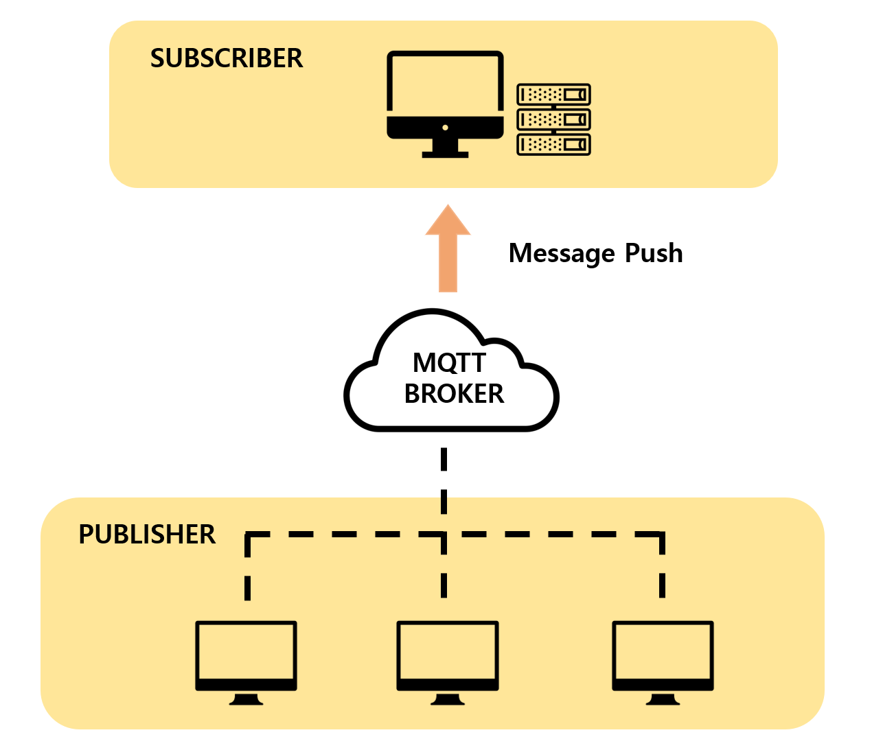

# Meercat(미 허용 소프트웨어 감지 시스템)
### MQTT통신을 이용한 단체PC 실시간 프로세스 제어 웹 서비스
<ul>
    <li> 프로젝트명 : 미어캣(미 허용 소프트웨어 감지 시스템) </li>
    <li> 개발 환경 : Windows, Ubuntu </li>
    <li> 개발 언어 : C/C++, JAVA, HTML5/CSS/JavaScript </li>
    <li> 개발 도구 : Visual Studio, Eclipse, Sublime Text </li>
    <li> 적용 기술 : MQTT, WMI, JNI, Bootstrap, AJax, JavaFx, Tomcat, MySQL </li>
    <li> 담당 분야 : Web Front-end, Back-end(Using MQTT Library ) </li>
</ul>

### MQTT 아키텍처

- 모든 Publisher는 MQTT Broker에 메시지를 전송한다.
- Subscriber가 Broker에게 특정 Publisher를 구독신청하면 Broker는 해당 Publisher의 메세지를 전송받는다. 
